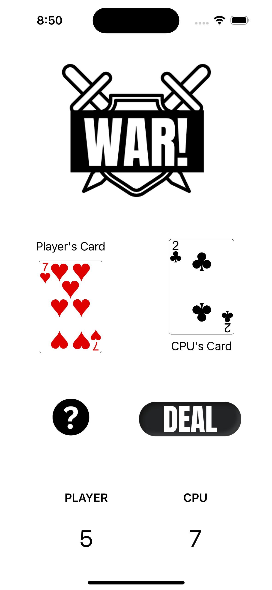
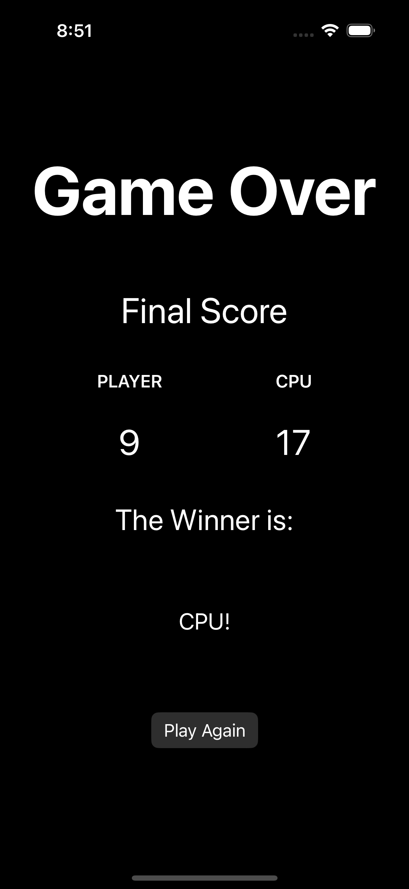

# WarApp
WarApp is my first introduction to Swift and app development. This app replicates the card game war, with a fully functioning deck of 52 cards that keeps track of what has been removed from the deck and what cards are left in play through the use of classes and arrays. This app focuses on Swiftui's navigation stack, the flow of logic, struct and classes, environments, working in different views, and UIDesign. To preview the app on a device continue reading below.

This is the game screen where the game is played by pressing "deal" and the rules are available to read

The rules screen experiments with Swift's tab view and follows the structure of page view, model and screen.

//

Finally, the game over screen plays around with Swift's sheet and presentation mode to make the game over screen pop up.

